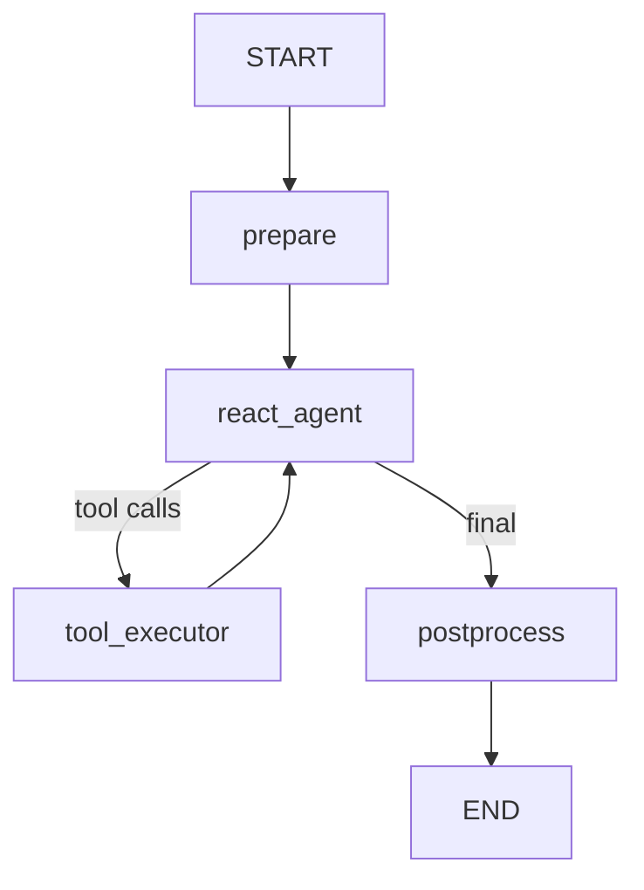

# UiPath LlamaIndex Template Agent

A quickstart UiPath LlamaIndex agent. It answers user queries using live tools and supports multiple LLM providers.

> **Docs:** [uipath-llamaindex quick start](https://uipath.github.io/uipath-python/llamaindex/quick_start/) — **Samples:** [uipath-llamaindex/samples](https://github.com/UiPath/uipath-integrations-python/tree/main/packages/uipath-llamaindex/samples)

## What it does

1. **Prepares** the conversation — injects a system prompt and the user question into workflow context
2. **Runs a ReAct agent step** that autonomously decides which tools to call and in what order
3. **Postprocesses** — validates and truncates the response if it exceeds the configured max length

### Tools

| Tool               | Description                                      |
| ------------------ | ------------------------------------------------ |
| `get_current_time` | Returns the current UTC date and time (ISO 8601) |
| `get_weather`      | Returns weather data for a city (mock data)      |

### LLM Providers

The template defaults to **Claude Haiku 4.5** via `UiPathChatBedrockConverse`. To switch providers, edit `main.py`:

```python
# Choose your LLM provider by uncommenting one of the following:
llm = UiPathChatBedrockConverse(model=BedrockModel.anthropic_claude_haiku_4_5)
# llm = UiPathOpenAI(model=OpenAIModel.GPT_4_1_MINI_2025_04_14.value)
# llm = UiPathVertex(model=GeminiModel.gemini_2_5_flash)
```

## Workflow



## Input / Output

```json
// Input
{
  "question": "What's the weather like in London?"
}

// Output
{
  "response": "..."
}
```

## Running locally

```bash
# Run
uv run uipath run agent --input-file input.json --output-file output.json

# Debug with dynamic node breakpoints
uv run uipath debug agent --input-file input.json --output-file output.json
```

## Evaluation

The agent ships with a tool call order evaluator that verifies the ReAct step calls `get_current_time` **before** `get_weather` when given a time-and-weather query, and an LLM judge that checks weather output for semantic similarity.

```bash
uv run uipath eval
```
