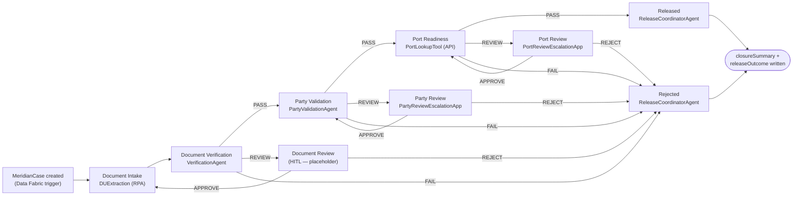
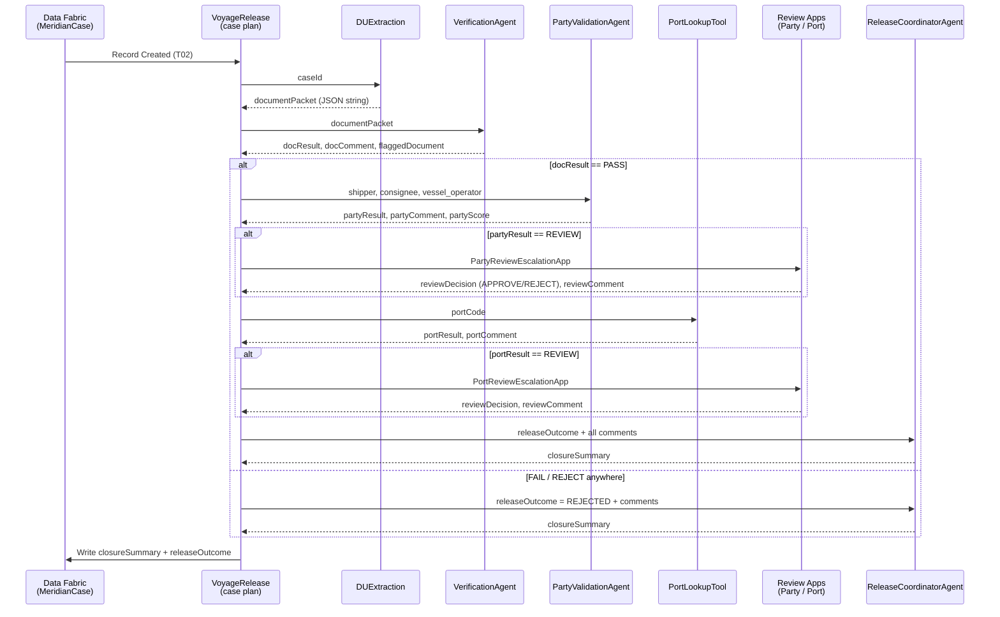

# Meridian — Voyage Release Solution

An end-to-end UiPath agentic solution that decides whether a maritime voyage may be **released**, **released with override**, or **rejected**. Every new voyage case is orchestrated through document extraction, agentic verification, denied-party screening, port readiness, human review, and a closing summary — all coordinated by a single Case Management plan.

> **Solution ID:** `990ba009-6046-4c17-c075-08ded2923459`
> **Business owner:** Maritime Compliance Reviewers · Operations Lead
> **Case-level SLA:** 24 h · **Trigger:** `MeridianCase` record created (UiPath Data Fabric)
> **This README lives in `ReleaseCoordinatorAgent/` but documents the whole solution.**

---

## Table of contents

1. [What Meridian does](#what-meridian-does)
2. [Solution architecture](#solution-architecture)
3. [Projects in this solution](#projects-in-this-solution)
4. [End-to-end flow](#end-to-end-flow)
5. [Case data model — `MeridianCase` entity](#case-data-model--meridiancase-entity)
6. [Case-level inputs and outputs](#case-level-inputs-and-outputs)
7. [Detailed project reference](#detailed-project-reference)
8. [Setup and deployment](#setup-and-deployment)
9. [Running and testing locally](#running-and-testing-locally)
10. [Personas, SLAs, review lanes](#personas-slas-review-lanes)
11. [File map](#file-map)
12. [Troubleshooting](#troubleshooting)

---

## What Meridian does

For every new voyage record dropped into UiPath Data Fabric, Meridian:

1. **Reads** the five shipping documents attached to the record (Bill of Lading, Cargo Manifest, Certificate of Origin, Insurance Certificate, Quality Certificate).
2. **Extracts** structured fields with Document Understanding.
3. **Verifies** the five documents are internally consistent (matching voyage id, vessel name, weights, dates, etc.).
4. **Screens** the shipper, consignee, and vessel operator against a denied-party list.
5. **Confirms** the destination port is open for the voyage.
6. **Routes** any flagged item (`REVIEW`) to a human compliance reviewer, and any hard-fail (`FAIL`) or rejection to a terminal Rejected stage.
7. **Writes** a professional one-paragraph closure summary — `RELEASED`, `RELEASED WITH OVERRIDE`, or `REJECTED` — that a Release Manager reads and signs off on.

The outcome is written **exactly once** per case to the `MeridianCase` entity as `releaseOutcome` + `closureSummary`.

---

## Solution architecture



Legend: rectangles are Case Management stages; each stage delegates its work to a single project. Arrows are conditional exits driven by `docResult` / `partyResult` / `portResult` / `reviewDecision`.

---

## Projects in this solution

| # | Project | Type | Role | Primary artefact |
|---|---------|------|------|------------------|
| 1 | **VoyageRelease** | Case Management | Orchestrator — stages, triggers, exits, variables | `caseplan.json` |
| 2 | **DUExtraction** | RPA (XAML) | Reads the 5 document files and emits `documentPacket` | `Main.xaml` |
| 3 | **VerificationAgent** | Low-code Agent | Checks the 5 documents for internal consistency | `agent.json` |
| 4 | **PartyValidationAgent** | Coded Agent (LlamaIndex + Python) | Screens shipper / consignee / vessel operator against denied-party lists | `agent.py`, `tools.py` |
| 5 | **PortLookupTool** | API Workflow | Looks up destination port status | `Workflow.json` |
| 6 | **ReleaseCoordinatorAgent** | Low-code Agent | Writes the final one-paragraph closure summary | `agent.json` |
| 7 | **PartyReviewEscalationApp** | Coded App | HITL screen for the Party Review lane | `Main.xaml` (app page) |
| 8 | **PortReviewEscalationApp** | Coded App | HITL screen for the Port Review lane | `Main.xaml` (app page) |

---

## End-to-end flow



The three verdicts a check can produce:

- **`PASS`** — clean, continue to next stage.
- **`REVIEW`** — indeterminate, divert to that stage's human-review lane. Reviewer either `APPROVE`s (case continues, marked `RELEASED_WITH_OVERRIDE` at the end) or `REJECT`s (case routes to Rejected).
- **`FAIL`** — hard fail, route directly to Rejected. No review lane.


---

## Case data model — `MeridianCase` entity

Meridian reuses the tenant's existing `MeridianCase` Data Fabric entity as both the trigger source and the sink for the final outcome. Every case reads its inputs from this record and writes back its verdicts to the same record.

**Data Fabric connection ID:** `340a34eb-b132-42ae-9efc-95c151a40b54`
**Entity name:** `MeridianCase`

| Field | Type | Direction | Set by | Purpose |
|-------|------|-----------|--------|---------|
| `caseId` | string | in | Trigger source | External case identifier (also surfaced as `=metadata.ExternalId`) |
| `voyageNumber` | string | in | Trigger source | Voyage number |
| `vesselName` | string | in | Trigger source | Vessel name |
| `vesselOperator` | string | in | Trigger source | Vessel operator (screened) |
| `shipper` | string | in | Trigger source | Shipper name (screened) |
| `consignee` | string | in | Trigger source | Consignee name (screened) |
| `destinationPortCode` | string | in | Trigger source | Destination port code (looked up by PortLookupTool) |
| `bolFile` | file | in | Trigger source | Bill of Lading |
| `cargoManifestFile` | file | in | Trigger source | Cargo manifest |
| `certificateOfOriginFile` | file | in | Trigger source | Certificate of Origin |
| `insuranceCertificateFile` | file | in | Trigger source | Insurance certificate |
| `qualityCertificateFile` | file | in | Trigger source | Quality certificate |
| `documentPacket` | string (JSON) | intermediate | DUExtraction | Extracted fields from all 5 documents |
| `docResult` | integer/enum | intermediate | VerificationAgent | `PASS` / `FAIL` / `REVIEW` |
| `docComment` | string | intermediate | VerificationAgent | One-sentence rationale |
| `docConfidence` | number | intermediate | VerificationAgent | 0-100 |
| `flaggedDocument` | string | intermediate | VerificationAgent | Which document to re-upload (on REVIEW/FAIL) |
| `partyResult` | integer/enum | intermediate | PartyValidationAgent | `PASS` / `FAIL` / `REVIEW` |
| `partyComment` | string | intermediate | PartyValidationAgent | One-sentence rationale |
| `partyScore` | number | intermediate | PartyValidationAgent | Worst denied-party score (0.0-1.0) |
| `portResult` | integer/enum | intermediate | PortLookupTool | `PASS` / `FAIL` / `REVIEW` |
| `portComment` | string | intermediate | PortLookupTool | One-sentence rationale |
| `reviewDecision` | integer/enum | intermediate | Review Apps | `APPROVE` / `REJECT` (empty if no review fired) |
| `reviewComment` | string | intermediate | Review Apps | Reviewer's note |
| `releaseOutcome` | integer/enum | **out** | ReleaseCoordinatorAgent | Final: `RELEASED` / `RELEASED_WITH_OVERRIDE` / `REJECTED` |
| `closureSummary` | string | **out** | ReleaseCoordinatorAgent | Human-readable closing paragraph |
| `caseStatus` | integer/enum | out | VoyageRelease | Case management status |

> `caseStatus` and the `*Result` fields are stored as integer enums in Data Fabric; the case plan maps them to the string values (`PASS`, `FAIL`, `REVIEW`, etc.) at binding time.

---

## Case-level inputs and outputs

### Input — a new `MeridianCase` record

Everything Meridian needs is in the record that fires the trigger. The five file fields carry the shipping documents; the scalar fields carry the case metadata.

**Minimum required fields** for a valid case:

- `caseId`, `voyageNumber`, `vesselName`, `vesselOperator`
- `shipper`, `consignee`, `destinationPortCode`
- All five document files: `bolFile`, `cargoManifestFile`, `certificateOfOriginFile`, `insuranceCertificateFile`, `qualityCertificateFile`

### Output — case closure fields

When the case exits (either via `Released` or `Rejected`), these fields are written back to the same `MeridianCase` record:

- `releaseOutcome` — one of `RELEASED`, `RELEASED_WITH_OVERRIDE`, `REJECTED`. Written exactly once.
- `closureSummary` — one clean professional paragraph (4-6 sentences), leading with the outcome in capitals.

Example `closureSummary`:

> RELEASED WITH OVERRIDE. Document verification passed with all five documents internally consistent. Party screening returned REVIEW due to a partial match against a denied-party watchlist entry for the vessel operator. Port readiness passed with the destination port (AEJEA — Jebel Ali) confirmed OPEN. The compliance reviewer approved the party override, noting the match was a false positive against a company with a similar trading name in a different jurisdiction.

---

## Detailed project reference

### 1. VoyageRelease — Case Management orchestrator

**Type:** Case Management (`caseplan.json`)
**Role:** Owns the state machine. Wires every other project together via variable bindings and conditional exits.

**Stages:**

| Order | Stage | Required | Task project | Type |
|-------|-------|----------|--------------|------|
| 1 | Document Intake | Yes | DUExtraction | RPA |
| 2 | Document Verification | Yes | VerificationAgent | Agent |
| 3 | Party Validation | Yes | PartyValidationAgent | Agent |
| 4 | Port Readiness | Yes | PortLookupTool | API Workflow |
| 5 | Released | Yes | ReleaseCoordinatorAgent | Agent |
| exc | Party Review | No | PartyReviewEscalationApp | Action App |
| exc | Port Review | No | PortReviewEscalationApp | Action App |
| exc | Document Review | No | *(placeholder)* | Action App |
| exc | Rejected | No | ReleaseCoordinatorAgent | Agent |

**Trigger (T02):** Integration Service EventTrigger on `uipath-uipath-dataservice`, listening for `CREATED` on the `MeridianCase` object.

**Case exit:** `required-stages-completed` marks the case complete. `Rejected` also emits an exit-only completion.

**Key files:**
- `caseplan.json` — full stage/task/variable definition
- `caseplan.json.bpmn` — BPMN visualization
- `sdd.draft.md` — the Solution Design Document (the source-of-truth spec for this case plan)
- `bindings_v2.json` — resource bindings resolved at deploy time

---

### 2. DUExtraction — RPA workflow (XAML)

**Type:** RPA / Studio Web workflow (`Main.xaml`)
**Role:** Reads the five document attachments from the `MeridianCase` record and runs Document Understanding to extract structured fields.

**Inputs:**
| Field | Type | Description |
|-------|------|-------------|
| `caseId` | string | Case identifier — used to look up the record and its five file attachments |

**Outputs:**
| Field | Type | Description |
|-------|------|-------------|
| `documentpacket` | string (JSON) | Aggregated JSON with 5 sub-objects: `bol`, `cargoManifest`, `certificateOfOrigin`, `insuranceCertificate`, `qualityCertificate`. Each carries extracted fields in snake_case. |

**Dependencies:**
- `UiPath.DocumentUnderstanding.Activities`
- `UiPath.DataService.Activities`
- `UiPath.IntegrationService.Activities`

**Sample PDFs shipped for testing:** `BOL_Ambiguous.pdf`, `Certificate_of_Origin_Ambiguous.pdf`, `Manifest_Ambiguous.pdf`.

---

### 3. VerificationAgent — Document consistency agent

**Type:** Low-code Agent (`anthropic.claude-sonnet-4-6`, temperature 0)
**Role:** Runs 5 consistency checks over the extracted document packet and returns a single verdict.

**Inputs:**
| Field | Type | Description |
|-------|------|-------------|
| `documentPacket` | string | JSON produced by DUExtraction |

**Outputs:**
| Field | Type | Description |
|-------|------|-------------|
| `docResult` | string | `PASS` / `FAIL` / `REVIEW` |
| `docComment` | string | Concise sentence (≤20 words) naming the involved document(s) and the issue |
| `docConfidence` | number | Integer 0-100 |
| `flaggedDocument` | string | One of `bol`, `manifest`, `coo`, `insurance`, `quality`, or empty on PASS/invalid-JSON FAIL |

**The five checks (in order):**
1. **field_consistency** — `voyage_id`, `vessel_name`, `shipper_name`, `consignee_name`, `destination_port_code` must agree across every doc that carries them.
2. **container_weight_consistency** — `gross_weight_kg` on BoL vs manifest within 2 %.
3. **certificate_completeness** — all 5 docs present with their key fields.
4. **amendment_propagation** — no stale field values contradicting BoL.
5. **inspection_date_sanity** — QC inspection date not in the future, plausible.

**Decision rule:**
- All 5 pass → `PASS`
- Exactly one doc missing/unreadable → `REVIEW`
- Hard contradiction or 2+ docs missing → `FAIL`
- Invalid JSON → `FAIL` (flaggedDocument empty)

See `SYSTEM_PROMPT.md` for the full prompt.

---

### 4. PartyValidationAgent — Denied-party screening (coded)

**Type:** Coded LlamaIndex Python Agent (ReAct pattern)
**Role:** Screens the three named parties against a denied-party list CSV using fuzzy matching, returns a single verdict.

**Inputs:**
| Field | Type | Description |
|-------|------|-------------|
| `shipper` | string | Shipper name |
| `consignee` | string | Consignee name |
| `vessel_operator` | string | Vessel operator name |
| `list_type` | string | Optional — `"escalation"` swaps to `denied_party_list_escalation.csv`; blank uses the default list |

**Outputs:**
| Field | Type | Description |
|-------|------|-------------|
| `partyResult` | string | `PASS` / `REVIEW` / `FAIL` |
| `partyComment` | string | One human-readable sentence |
| `partyScore` | number | Worst party score 0.0-1.0; `0.0` when clear |

**Key files:**
- `agent.py` — LlamaIndex ReAct workflow definition
- `main.py` — entry point
- `matching.py` — fuzzy name-matching logic
- `tools.py` — tool definitions the ReAct agent can call
- `denied_party_list.csv` — the default denied-party list
- `denied_party_list_escalation.csv` — the alternate list for escalation
- `pyproject.toml` — Python dependencies (managed with `uv`)
- `evaluations/` — evaluators and eval sets

**LLM:** defaults to Claude Haiku 4.5 via `UiPathChatBedrockConverse` (switchable in `main.py`).

---

### 5. PortLookupTool — API Workflow

**Type:** API Workflow (`Workflow.json`)
**Role:** Deterministic lookup that returns the operational status of a destination port.

**Inputs:**
| Field | Type | Description |
|-------|------|-------------|
| `portCode` | string | Destination port code (e.g. `AEJEA`, `AEAUH`) |

**Outputs:**
| Field | Type | Description |
|-------|------|-------------|
| `portResult` | string | `PASS` (port OPEN) / `FAIL` (port DENIED) / `REVIEW` (unknown/indeterminate) |
| `portComment` | string | One-sentence rationale |

**Current lookup table (embedded in JS):**
| Port code | Name | Status |
|-----------|------|--------|
| `AEJEA` | Jebel Ali | OPEN |
| `AEAUH` | Abu Dhabi | OPEN |

Any unrecognized code returns `REVIEW`. Extend by editing the `portData` object in `Workflow.json` → `Javascript_1`.

---

### 6. ReleaseCoordinatorAgent — Closure summary agent *(this project)*

**Type:** Low-code Agent (`anthropic.claude-sonnet-4-6`, temperature 0.4)
**Role:** Writes the final one-paragraph closing summary a Release Manager reads and signs off on. **Does not decide** — `releaseOutcome` is already final by the time this agent runs.

**Inputs:**
| Field | Type | Required | Description |
|-------|------|:--------:|-------------|
| `releaseOutcome` | string | ✓ | Already-decided outcome: `RELEASED`, `RELEASED_WITH_OVERRIDE`, or `REJECTED` |
| `docResult` | string | ✓ | Document verification verdict (`PASS`/`FAIL`/`REVIEW`) |
| `docComment` | string | ✓ | Document verification one-sentence rationale |
| `partyResult` | string | ✓ | Party screening verdict |
| `partyComment` | string | ✓ | Party screening rationale |
| `portResult` | string | ✓ | Port readiness verdict |
| `portComment` | string | ✓ | Port readiness rationale |
| `reviewDecision` | string | — | `APPROVE` / `REJECT` if a human reviewed a flagged item; empty otherwise |
| `reviewComment` | string | — | Reviewer's note; empty otherwise |

**Outputs:**
| Field | Type | Description |
|-------|------|-------------|
| `closureSummary` | string | One professional paragraph (4-6 sentences). Leads with the outcome in capitals. |

**Constraints on the summary:**
- Starts with `RELEASED`, `RELEASED WITH OVERRIDE`, or `REJECTED` in caps.
- Summarizes each of the three checks in order: docs → parties → port.
- If `reviewDecision` is non-empty, states that a human reviewed and what they decided.
- Prose only — no bullets, headers, markdown, or JSON.
- Invents nothing not in the inputs.
- Never uses decision language ("I recommend…") — it explains, not decides.

See `SYSTEM_PROMPT.md` for the full prompt.

---

### 7. PartyReviewEscalationApp — Party Review HITL app

**Type:** Coded App
**Role:** Screen shown to a Maritime Compliance Reviewer when `partyResult == "REVIEW"`. The reviewer sees the parties and the screening rationale, then chooses **Approve** or **Reject** with a free-text comment.

**Inputs (bound from the case):**
- `CaseId`, `VesselName`, `VoyageNumber`
- `Shipper`, `Consignee`, `VesselOperator`
- `PartyComment`, `PartyScore`

**Outputs (bound back to the case):**
- `Action` → `reviewDecision` (`Approve`/`Reject`)
- `ReviewComments` → `reviewComment`

**Pages:** `Main.xaml`, `MeridianCaseReviewPagePage1_Approve_click.xaml`, `MeridianCaseReviewPagePage1_Reject_click.xaml`.

---

### 8. PortReviewEscalationApp — Port Review HITL app

**Type:** Coded App
**Role:** Screen shown to a Maritime Compliance Reviewer when `portResult == "REVIEW"`. Same pattern as the Party Review app but for port readiness.

**Inputs (bound from the case):**
- `CaseId`, `VesselName`, `VoyageNumber`
- `DestinationPortCode`, `PortComment`

**Outputs (bound back to the case):**
- `Action` → `reviewDecision` (`Approve`/`Reject`)
- `ReviewComment` → `reviewComment`

**Pages:** `Main.xaml`, `MeridianCaseReviewPage_Approve_click.xaml`, `MeridianCaseReviewPage_Reject_click.xaml`.


---

## Setup and deployment

### Prerequisites

- **UiPath Cloud tenant** with these services enabled:
  - Automation Cloud (Orchestrator)
  - Data Fabric (a.k.a. Data Service)
  - Integration Service
  - Agent Builder / Coded Agents (Python runtime)
  - Case Management
  - Apps
  - Document Understanding
- **Data Fabric entity** — `MeridianCase` with the fields listed in [Case data model](#case-data-model--meridiancase-entity).
- **Integration Service connection** — `uipath-uipath-dataservice` (default tenant connection ID `340a34eb-b132-42ae-9efc-95c151a40b54`).
- **Reviewer group** — a UiPath user group named `Maritime Compliance Reviewers` (for HITL routing and SLA at-risk notifications) and `Operations Leadership` (for SLA breach escalations).
- **LLM access** — Claude Sonnet 4.6 (VerificationAgent, ReleaseCoordinatorAgent) and Claude Haiku 4.5 via Bedrock (PartyValidationAgent) enabled in the LLM Gateway.

### First-time deployment order

Because the case plan resolves resource IDs at pack time, the referenced projects must exist first. Deploy in this order:

1. **DUExtraction** — publish the RPA process.
2. **VerificationAgent** — publish the agent.
3. **PartyValidationAgent** — `uv sync`, then publish the coded agent (see project-specific README inside `PartyValidationAgent/README.md`).
4. **PortLookupTool** — publish the API workflow.
5. **ReleaseCoordinatorAgent** — publish the agent.
6. **PartyReviewEscalationApp** — publish the Coded App.
7. **PortReviewEscalationApp** — publish the Coded App.
8. **VoyageRelease** — publish the case plan **last**. Its `bindings_v2.json` references every project above; if any is missing, `uip solution pack` will report unresolved bindings.

### Solution pack + publish

The whole solution is deployable as a single `.uipx` via the `uip solution` CLI. From within Studio Web, use the built-in **Publish Solution** action, or from a terminal:

```bash
# Pack all 8 projects into one .uipx
uip solution pack

# Publish the packed solution to a folder
uip solution publish --folder-path "<Your Folder>"

# Deploy + activate in one step
uip solution deploy --folder-path "<Your Folder>"
uip solution activate --folder-path "<Your Folder>"
```

### After deployment — wiring the reviewer role

The two review apps (`PartyReviewEscalationApp`, `PortReviewEscalationApp`) route their action tasks to the `Maritime Compliance Reviewer` role. After deploying, assign your compliance users to that role in Orchestrator → Roles → Maritime Compliance Reviewer.

### Placeholder — Document Review app

The SDD calls out a third HITL lane (**Document Review**) for when `docResult == "REVIEW"`. That Action App is **not shipped in this solution yet**; the case plan's Document Review stage will surface as a high-severity review item at publish time until you deploy an app that emits the required schema (Action + reviewComment + five re-upload file slots). See the SDD (`VoyageRelease/sdd.draft.md`) for the exact input/output contract.

---

## Running and testing locally

Every project below can be exercised in isolation before you deploy the case plan.

### VerificationAgent (this pattern applies to every low-code agent)

From Studio Web with the agent open:

- Click **Play** and paste a test `documentPacket` JSON into the input pane.
- Or use the eval sets under `evals/eval-sets/` — click **Run eval** to score the agent against the shipped test cases.

### PartyValidationAgent

The project ships as a self-contained Python package managed with `uv`.

```bash
# From /solution/PartyValidationAgent
uv sync                                    # install dependencies

# Run the agent against a local input file
uv run uipath run agent --input-file input.json --output-file output.json

# Debug with breakpoints
uv run uipath debug agent --input-file input.json --output-file output.json

# Run the shipped evaluations
uv run uipath eval
```

Sample `input.json`:
```json
{
  "shipper": "Acme Trading Co",
  "consignee": "Blue Harbor Imports",
  "vessel_operator": "Helios Maritime Ltd",
  "list_type": ""
}
```

### PortLookupTool

Test with the API Workflow **Run** button in Studio Web using inputs like:
```json
{ "portCode": "AEJEA" }   // → { portResult: "PASS", portComment: "Jebel Ali (AEJEA) status OPEN." }
{ "portCode": "XXXXX" }   // → { portResult: "REVIEW", portComment: "Unrecognized port code XXXXX; status UNKNOWN." }
```

### ReleaseCoordinatorAgent

Sample input:
```json
{
  "releaseOutcome": "RELEASED_WITH_OVERRIDE",
  "docResult": "PASS",
  "docComment": "All five consistency checks passed.",
  "partyResult": "REVIEW",
  "partyComment": "Partial name match on vessel operator against denied-party list.",
  "portResult": "PASS",
  "portComment": "Jebel Ali (AEJEA) status OPEN.",
  "reviewDecision": "APPROVE",
  "reviewComment": "False positive — different company, same name."
}
```

Expected output: one professional paragraph starting with `RELEASED WITH OVERRIDE`.

### VoyageRelease (end-to-end)

To exercise the full pipeline, create a new `MeridianCase` record in Data Fabric with all five file fields populated. The Case Management trigger fires within seconds and the case runs autonomously through every stage until it writes `releaseOutcome` and `closureSummary` back to the record.

You can watch the run in **Orchestrator → Cases → VoyageRelease**.

---

## Personas, SLAs, review lanes

### Personas

| Persona | Scope | Permissions |
|---------|-------|-------------|
| **Maritime Compliance Reviewer** | Party Review, Port Review, Document Review | View, Act, Reassign |
| **Operations Lead** | All stages | View, Act, Reassign — receives SLA breach escalations |

### SLA rules

- **Case-level SLA:** 24 h.
- **At-Risk** (75 % elapsed) → notify `Maritime Compliance Reviewers` user group.
- **Breached** (100 % elapsed) → notify `Operations Leadership` user group.

### Review lane behavior

Each review lane fires when the corresponding check returns `REVIEW`. The reviewer chooses **Approve** or **Reject**:

| Action | Effect |
|--------|--------|
| **Approve** | Returns to the originating stage; the originating task is skipped (`Run Only Once: Yes`) and its completion gate re-evaluates with the lane's override flag set. Final `releaseOutcome` will be `RELEASED_WITH_OVERRIDE`. |
| **Reject** | Routes directly to **Rejected**; no override flag is set. Final `releaseOutcome` will be `REJECTED`. |

`REJECT` never returns to the origin; it always exits to Rejected. `APPROVE` from Document Review re-enters **Document Intake** (not Document Verification) so DUExtraction re-runs on the corrected file.

---

## File map

```
/solution/
├── DUExtraction/                     # RPA — reads 5 docs, emits documentPacket
│   ├── Main.xaml
│   ├── entry-points.json
│   ├── project.json
│   ├── BOL_Ambiguous.pdf             # sample test docs
│   ├── Certificate_of_Origin_Ambiguous.pdf
│   └── Manifest_Ambiguous.pdf
│
├── VerificationAgent/                # Low-code agent — 5 consistency checks
│   ├── agent.json                    # config + input/output schema + prompt
│   ├── SYSTEM_PROMPT.md              # mirror of agent.json prompt (editable)
│   ├── entry-points.json
│   ├── evals/                        # eval sets + evaluators
│   └── flow-layout.json
│
├── PartyValidationAgent/             # Coded LlamaIndex agent (Python)
│   ├── agent.py                      # ReAct workflow
│   ├── main.py                       # entry point
│   ├── matching.py                   # fuzzy party name matcher
│   ├── tools.py                      # tool definitions
│   ├── denied_party_list.csv         # default list
│   ├── denied_party_list_escalation.csv
│   ├── evaluations/
│   ├── pyproject.toml, uv.lock
│   ├── llama_index.json, uipath.json
│   ├── README.md, AGENTS.md, CLAUDE.md
│   └── agent.mermaid                 # visual of the ReAct graph
│
├── PortLookupTool/                   # API Workflow — port status lookup
│   ├── Workflow.json                 # JS lookup table + response
│   └── entry-points.json
│
├── ReleaseCoordinatorAgent/          # Low-code agent — writes closureSummary
│   ├── agent.json
│   ├── SYSTEM_PROMPT.md
│   ├── entry-points.json
│   ├── evals/
│   └── README.md                     # ← this file (solution-wide docs)
│
├── PartyReviewEscalationApp/         # Coded App — Party Review HITL screen
│   ├── Main.xaml
│   ├── MeridianCaseReviewPagePage1_Approve_click.xaml
│   └── MeridianCaseReviewPagePage1_Reject_click.xaml
│
├── PortReviewEscalationApp/          # Coded App — Port Review HITL screen
│   ├── Main.xaml
│   ├── MeridianCaseReviewPage_Approve_click.xaml
│   └── MeridianCaseReviewPage_Reject_click.xaml
│
└── VoyageRelease/                    # Case Management orchestrator
    ├── caseplan.json                 # ← the state machine
    ├── caseplan.json.bpmn            # BPMN visualization
    ├── sdd.draft.md                  # Solution Design Document (spec)
    ├── bindings_v2.json              # resolved resource bindings
    └── entry-points.json
```

---

## Troubleshooting

### The case sits in Document Intake forever

- Confirm the `MeridianCase` record actually has file attachments in **all five** file fields — DUExtraction needs every one.
- Check the DUExtraction job logs in Orchestrator for Document Understanding activity failures (bad PDFs, missing DU license, timeout).

### VerificationAgent always returns `FAIL` with `flaggedDocument = ""`

That's the signature of an **invalid JSON** `documentPacket`. Inspect the DUExtraction output — the agent expects a JSON string with keys `bol`, `cargoManifest`, `certificateOfOrigin`, `insuranceCertificate`, `qualityCertificate`, each holding an object of extracted fields.

### PartyValidationAgent returns `REVIEW` for every case

Most likely the denied-party CSV isn't packaged with the deployment. Confirm `denied_party_list.csv` is present under the deployed agent's working directory. Also check `list_type` — a value other than `""` or `"escalation"` silently falls through to the default.

### PortLookupTool returns `REVIEW` for a port you know is open

`Workflow.json`'s embedded `portData` map only contains `AEJEA` and `AEAUH`. Add the port code + status to that object and republish.

### Review lane fires but nothing lands in the reviewer's inbox

- Verify the reviewer belongs to the `Maritime Compliance Reviewers` user group.
- Check the review app is deployed to the same folder as the case plan.
- Confirm the case plan's app binding (`PartyReviewEscalationApp` / `PortReviewEscalationApp`) resolves — a stale `bindings_v2.json` after project rename is a common cause.

### `releaseOutcome` never gets written

- The case must reach either the **Released** or **Rejected** stage — check the stage state in Orchestrator → Cases.
- Confirm ReleaseCoordinatorAgent's job succeeded. It requires all 7 required inputs (`releaseOutcome`, `docResult`, `docComment`, `partyResult`, `partyComment`, `portResult`, `portComment`) to be non-null.
- Data Fabric write-back on case exit is handled by the case plan's built-in output binding — if the case exit fires but the record isn't updated, check the Data Fabric connection health.

### After a review APPROVE, the case loops back into the same review

The per-lane override flag (`partyOverride` or `portOverride`) didn't get set. Two common causes:
- The app's Approve button binding doesn't write `Action = "Approve"` back to the case plan's output slot.
- The originating stage's completion condition isn't checking the override flag. Rebuild the stage exit condition from the SDD if in doubt.

### Closure summary uses decision language ("I recommend…")

ReleaseCoordinatorAgent's prompt explicitly forbids this. If you see it in output, the model drifted — inspect the agent run and consider lowering `temperature` (currently `0.4`) or tightening the prompt's CONSTRAINTS block.

---

## Where to make changes

| I want to change… | Edit this |
|-------------------|-----------|
| The state machine / stage flow | `VoyageRelease/caseplan.json` (and update `sdd.draft.md`) |
| Document consistency rules | `VerificationAgent/SYSTEM_PROMPT.md` **and** `agent.json` (they must match) |
| Denied-party list | `PartyValidationAgent/denied_party_list.csv` |
| Port status table | `PortLookupTool/Workflow.json` → `Javascript_1` node |
| Closure summary wording / rules | `ReleaseCoordinatorAgent/SYSTEM_PROMPT.md` **and** `agent.json` |
| HITL screen layout | The relevant `*ReviewEscalationApp/Main.xaml` |
| Case-level SLA duration | `VoyageRelease/caseplan.json` → `metadata.slaRules` |
| Reviewer roles / groups | Orchestrator → Roles + the SLA notification bindings in `caseplan.json` |

---

*Last updated: 2026-07 · Solution version 23.0.0 · Case plan storage version 50.0.0*
